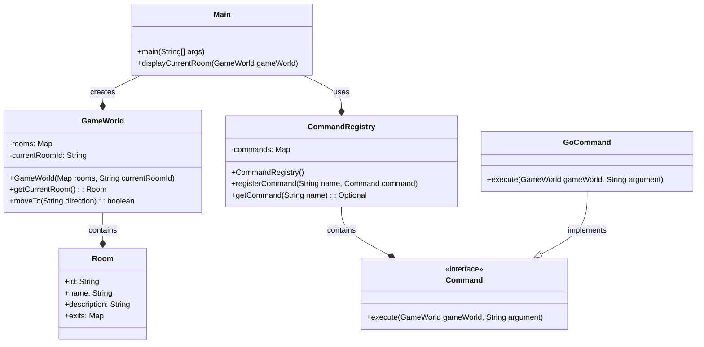
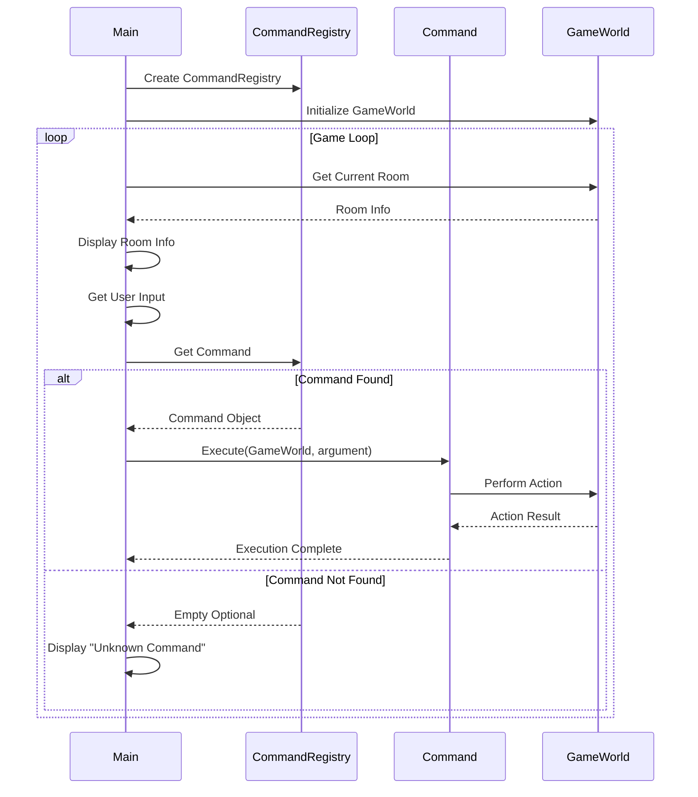

# Project Odyssey - Game Engine

This project implements a simple text-based adventure game engine in Java that allows players to explore interconnected rooms using text commands. The core components are:

- **Room:** Represents a location in the game with an ID, name, description, and available exits.
- **GameWorld:** Manages the game state including rooms and player's current location.
- **Command:** An interface for executable game actions (e.g., "go", "look", "help").
- **CommandRegistry:** Handles command registration and execution based on user input.
- **Main:** The entry point that initializes the game world and runs the main game loop.

## Class Diagram

## Sequence Diagram - Game Loop

