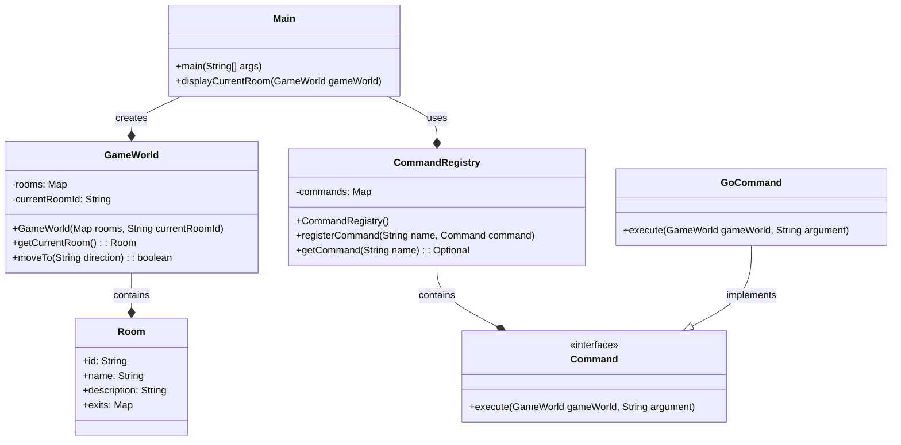
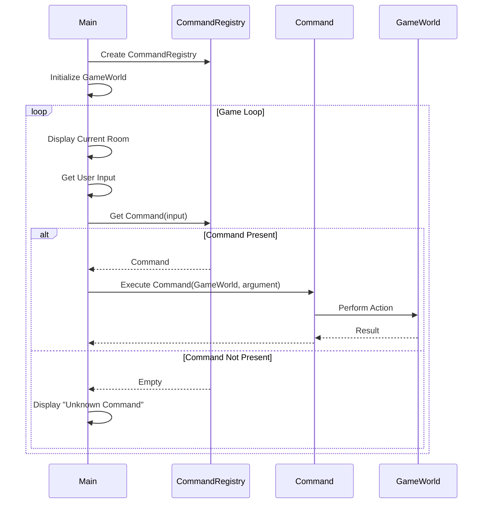

# Project Odyssey - Game Engine

This project implements a simple text-based adventure game engine in Java. The core components are:

- **Room:** Represents a location in the game, with a description and exits.
- **GameWorld:** Manages the collection of rooms and the player's current location.
- **Command:** An interface for executable actions (e.g., "go north").
- **CommandRegistry:** Registers and retrieves commands based on user input.
- **Main:** The entry point, handles game initialization and the main game loop.

## Class Diagram

## Sequence Diagram - Game Loop

